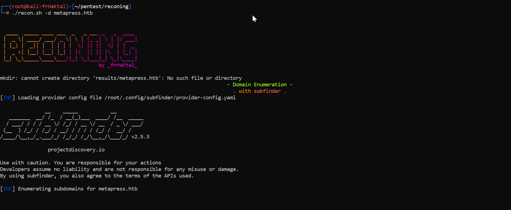

# Reconing
Reconing is automated bash script for recon phase in pentest/bugbounty
with subfinder,assetfinder,amass, spf record test, sourcemap scan, scan source disclosure, subdomain in js file, find secret in js, massdns resolvers, heartbleed scan, cors misconfigurations, takeover,amazon s3 bucker, param spider, ssti scan, lfi scan, open redirection scan, naabu scan, and final screenshots of all domain alive with eyewitness.

